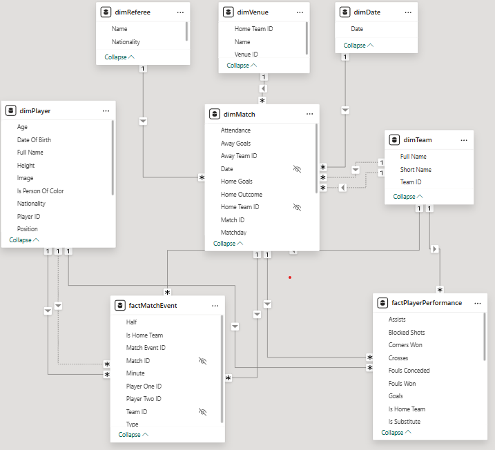

# Ekstraklasa referee racial bias analysis

Analysis project focused on referee decision-making in Ekstraklasa, with emphasis on potential racial bias patterns. Includes a set of tools for data acquisition, cleaning and formatting, enrichment via secondary sources, and Power BI analysis and  visualisation.

> **Data:** the full dataset is available in the [Releases](../../releases) section of this repository.

## Power BI

### Data Model



## Data generation

```bash
pip install -r requirements.txt

python opta_scraper
pytest opta_scraper
python opta_formatter
python transfermarkt_scraper
```

Flags for each step are documented under [Modules](#modules) below.

## Modules

### `opta_scraper`
Scrapes match and player data from Opta. Supports headless browser mode.

- `--headless` - run browser in headless mode (default: `false`)

### `opta_formatter`
Cleans and transforms raw Opta data into structured CSVs for downstream use.

- `--data-in` - path to raw scraper output (default: `data/optaformatter/result`)
- `--data-out` - path to write formatted output (default: `data/optascraper/result`)

### `transfermarkt_scraper`
Enriches player data with nationality flags and biographical metadata sourced from Transfermarkt. Uses DuckDuckGo to locate player profile pages, then scrapes flag/nationality data from those profiles. Reads `dimPlayer.csv` produced by `opta_formatter` and writes enriched results to CSV.

- `--headless` - run browser in headless mode (default: `false`)
- `--data-in` - path to `dimPlayer.csv` from `opta_formatter` (default: `data/optaformatter/result/dimPlayer.csv`)
- `--data-out` - path to write output (default: `data/transfermarktscraper`)
- `--test` - limit run to first 3 rows (default: `false`)
- `--no-prompt` - skip players with missing Transfermarkt links instead of prompting for manual input (default: `false`)

---

## PL 🇵🇱

# Analiza potencjalnych uprzedzeń rasowych sędziów Ekstraklasy

Projekt analityczny badający decyzje sędziów podejmowane na boisku w Ekstraklasie, ze szczególnym uwzględnieniem potencjalnych wzorców uprzedzeń rasowych. Zawiera zestaw narzędzi do pozyskiwania danych, ich czyszczenia i formatowania, oraz wzbogacania o informacje ze źródeł wtórnych oraz analizy i wizualizacji w Power BI.

> **Dane:** pełny zbiór danych dostępny jest w sekcji [Releases](../../releases) tego repozytorium.

## Generowanie danych

```bash
pip install -r requirements.txt

python opta_scraper
pytest opta_scraper
python opta_formatter
python transfermarkt_scraper
```

Flagi dla każdego kroku opisane są w sekcji [Moduły](#moduły) poniżej.

## Moduły

### `opta_scraper`
Pobiera dane o meczach i zawodnikach z Opta. Obsługuje tryb przeglądarki headless.

- `--headless` - uruchamia przeglądarkę w trybie headless (domyślnie: `false`)

### `opta_formatter`
Czyści i przekształca surowe dane z Opta w ustrukturyzowane pliki CSV do dalszego wykorzystania.

- `--data-in` - ścieżka do surowych danych ze scrapera (domyślnie: `data/optaformatter/result`)
- `--data-out` - ścieżka zapisu sformatowanych danych (domyślnie: `data/optascraper/result`)

### `transfermarkt_scraper`
Wzbogaca dane zawodników o flagi narodowości oraz dane biograficzne pozyskane z Transfermarkt. Korzysta z DuckDuckGo, aby odnaleźć profile zawodników, a następnie pobiera z nich dane o fladze/narodowości. Wczytuje plik `dimPlayer.csv` wygenerowany przez `opta_formatter` i zapisuje wzbogacone dane do pliku CSV.

- `--headless` - uruchamia przeglądarkę w trybie headless (domyślnie: `false`)
- `--data-in` - ścieżka do pliku `dimPlayer.csv` z `opta_formatter` (domyślnie: `data/optaformatter/result/dimPlayer.csv`)
- `--data-out` - ścieżka zapisu wyników (domyślnie: `data/transfermarktscraper`)
- `--test` - ogranicza uruchomienie do pierwszych 3 wierszy (domyślnie: `false`)
- `--no-prompt` - pomija zawodników z brakującymi linkami do Transfermarkt zamiast prosić o ręczne uzupełnienie (domyślnie: `false`)